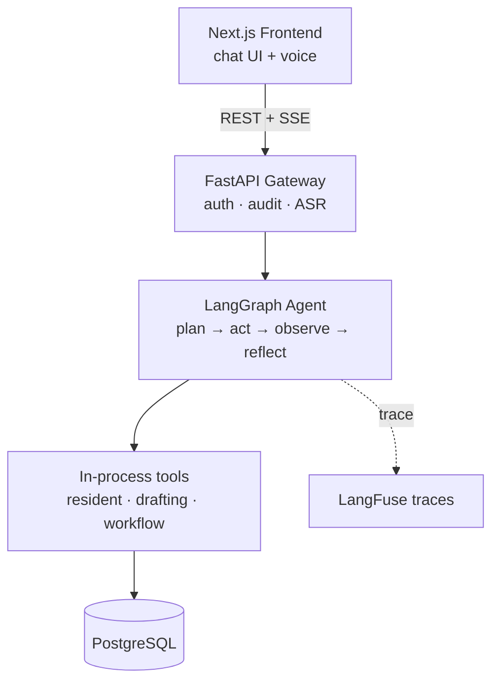

# dexter-mini

Voice-driven **Care Shift Copilot** — a vertical slice of an agentic care-documentation product.

A caregiver speaks; an agent listens, asks smart follow-up questions, drafts SIS-structured care notes, validates them against the source transcript, flags clinical risks, and hands the draft back for sign-off.

Full design in [SPEC.md](./SPEC.md).

## Architecture (target)



Day 1 ships the foundation in **bold**: Postgres, Tortoise models, SIS Pydantic schemas, FastAPI gateway, seeded demo data.

## Quick start

```bash
cp .env.example .env
docker compose up --build
```

To run the gateway directly (without Docker), the project uses **uv**:

```bash
cd apps/gateway
uv sync
uv run uvicorn app.main:app --reload
```

On first start the gateway runs Tortoise's `generate_schemas` and seeds eight demo residents (each with a care plan and seven days of historical events).

Verify:

```bash
curl http://localhost:8000/health
# {"status":"ok","db":"ok","residents_seeded":8}
```

Inspect the data directly:

```bash
docker compose exec db psql -U dexter -d dexter -c "SELECT room_number, first_name, last_name FROM residents ORDER BY room_number;"
```

## Repo layout

```
dexter-mini/
├── apps/
│   └── gateway/                FastAPI + Tortoise ORM
│       ├── app/
│       │   ├── main.py         lifespan, app wiring
│       │   ├── config.py       pydantic-settings
│       │   ├── db.py           Tortoise config
│       │   ├── models/         Tortoise models
│       │   ├── schemas/        SIS Pydantic schemas + enums
│       │   ├── routes/         REST routes
│       │   └── seeds/          demo data
│       ├── pyproject.toml
│       └── Dockerfile
├── docker-compose.yml
├── SPEC.md
└── README.md
```

## Stack

| Layer | Choice |
|---|---|
| Backend | FastAPI (Python 3.12) |
| Package manager | uv |
| ORM | Tortoise ORM + asyncpg |
| DB | PostgreSQL 16 |
| Schemas | Pydantic v2 |
| Settings | pydantic-settings |

The agent, LLM client, evals, and frontend land in subsequent days — see the 7-day plan in [SPEC.md §10](./SPEC.md).

## Database

Day 1 uses Tortoise's `generate_schemas(safe=True)` for zero-friction iteration. Once the schema stabilises we switch to **Aerich** for migrations.

### Tables

- `residents` — demographics, room, baseline vitals
- `care_plans` — goals, risk flags, dietary restrictions, mobility status
- `care_events` — structured SIS entries with `theme`, `content` (JSON), `status`, `source_transcript`, `request_id`
- `audit_log` — every tool / LLM / DB action with `request_id`, `cost_usd`, `latency_ms`
- `review_flags` — escalations raised by the agent for care-manager attention
- `eval_runs` — golden-set scores over time

## Reset the database

```bash
docker compose down -v
docker compose up --build
```
