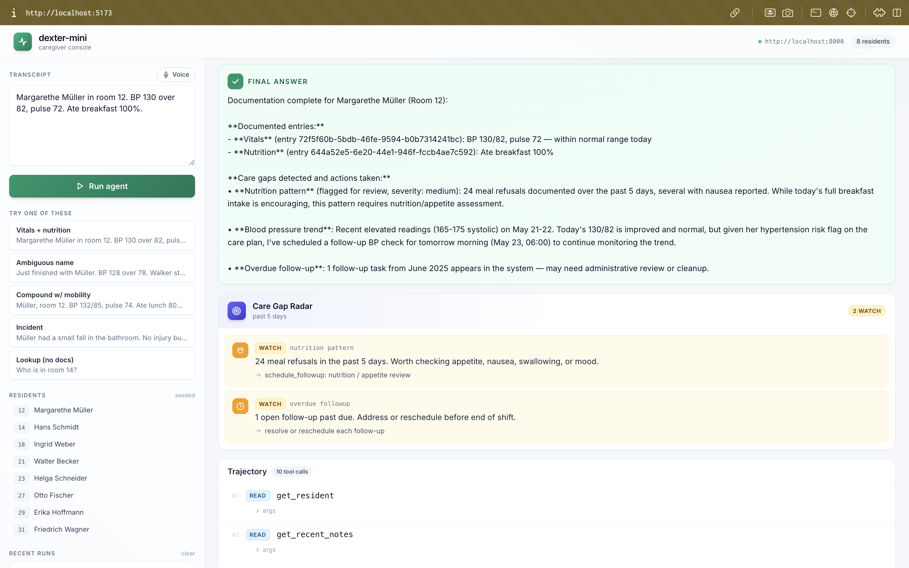
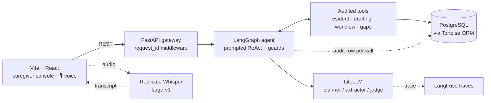

# dexter-mini

Voice-driven **Care Shift Copilot** for German elderly-care homes. A caregiver speaks; an agent drafts SIS notes, validates against the transcript, flags clinical risks, and surfaces care gaps the caregiver might have missed.

- [CLAUDE.md](./CLAUDE.md) — codebase notes
- [DEMO_RUN.md](./DEMO_RUN.md) — 10 captured agent runs



## Architecture



## Quick start

```bash
cp .env.example .env          # add REPLICATE_API_TOKEN
docker compose up --build     # Postgres + gateway
```

```bash
cd apps/web && npm install && npm run dev   # http://localhost:5173
```

Web is intentionally out of compose. Verify the gateway:

```bash
curl http://localhost:8000/health
# {"status":"ok","db":"ok","residents_seeded":8}
```

### Try it

Open [http://localhost:5173](http://localhost:5173) and paste any of these (more in [DEMO_RUN.md](./DEMO_RUN.md)):

```
Frau Müller, room 12. BP 128 over 78, pulse 70. Ate her full breakfast.
```

```
Mrs. Müller refused breakfast again, felt nauseous, and walked to the dining room with her walker.
```

```
Frau Müller, room 12. BP 1650 over 1020. Refused breakfast, looks tired.
```

## Common commands

```bash
# tests (in-memory SQLite, sub-second)
cd apps/gateway && uv run pytest

# eval harness
uv run python -m app.evals
uv run python -m app.evals --case muller-elevated-bp-and-refusal

# replay a request's full trajectory
curl -s http://localhost:8000/audit/<request_id> | jq

# reset the DB
docker compose down -v && docker compose up --build
```

## Features

- **Voice** — mic → Replicate Whisper large-v3 → textarea
- **Agent** — LangGraph + prompted ReAct (no native function-calling needed), MemorySaver checkpointer
- **Resident lookup** — fuzzy match by name / room / UUID; 24h activity snapshot returned so the agent sees prior context
- **Six SIS themes** — vitals, nutrition, mobility, cognition, social, incident
- **Validator** — per-field grounding against the transcript, 2-retry budget, draft flips to `needs_review` on fail
- **Autonomous flagging** — fires on abnormal vitals, plan-risk + behaviour conflicts, escalating patterns
- **Pause / resume** — `ask_caregiver` interrupts the graph; client resumes by `thread_id`
- **🛰️ Care Gap Radar** — proactive scan after drafting: refusal patterns, missing-today vitals, escalating trends, unaddressed plan risks, overdue follow-ups
- **Safety guards** — anti-hallucination, missing-flag, claimed-but-not-called-flag, implausibility (no silent value substitution)
- **Full audit log** — one row per tool call + LLM call, joined by `request_id`
- **Eval harness** — golden-set with trajectory + outcome scoring, provider comparison
- **Per-role LLM cascade** — planner / extractor / judge, primary + fallback, any LiteLLM provider

### HTTP surface

| Method | Path | Purpose |
| --- | --- | --- |
| POST | `/agent/run` | Start a conversation |
| POST | `/agent/resume` | Reply to an `ask_caregiver` interrupt |
| POST | `/transcribe` | Voice (multipart audio) → transcript |
| GET  | `/residents` | Seeded resident list |
| GET  | `/audit/{request_id}` | Full trajectory replay |
| GET  | `/health` | DB + seed status |

## Stack

| Layer        | Choice                                              |
| ------------ | --------------------------------------------------- |
| Backend      | FastAPI (Python 3.12), uv-managed                   |
| Agent        | LangGraph + LangChain core (prompted ReAct)         |
| LLM client   | LiteLLM (Replicate default, any provider works)     |
| ASR          | Replicate Whisper large-v3                          |
| ORM          | Tortoise ORM + asyncpg                              |
| Database     | PostgreSQL 16 (SQLite in tests + evals)             |
| Frontend     | Vite + React 18 + TypeScript + Tailwind 3           |
| Observability| LangFuse + audit_log                                |

## Repo layout

```
apps/
  gateway/    FastAPI + Tortoise (agent/ evals/ llm/ routes/ tools/ schemas/ seeds/)
  web/        Vite + React single-page console
docker-compose.yml   db + gateway
```

## Database

Tables: `residents`, `care_plans`, `care_events`, `audit_log`, `review_flags`, `followups`, `eval_runs`. Schema via Tortoise's `generate_schemas(safe=True)` — `docker compose down -v` to reset.
